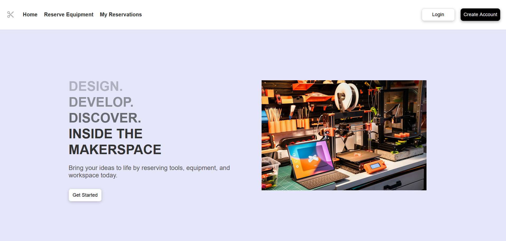

# How to Run
Note that this is not a comprehensive guide and you will likely encounter issues that will require some light troubleshooting to fix. Be sure to read output from your terminals and browser console if you get stuck.

- Navigate to the directory you want to store the project files in and clone the repository by running:
  ```
  git clone https://csgit.ucalgary.ca/carter.marcelo/seng513-fall24-group-16.git
  ```
- Go to the project root:
  ```
  cd seng513-fall24-group-16
  ```
- Confirm you are on the production branch by running:
  ```
  git checkout main
  ```
- In backend/seed.js, set the value of the variable 'clear' to true if you want to clear and seed backend/database.db every time the backend starts, otherwise leave it as false.

## Local Development Servers
- In frontend/src/axios.ts, find the constant 'axiosInstance' and set the value of 'baseURL' to `http://localhost:8080`.
- Open two terminals and navigate to the frontend folder in one and the backend folder in the other.
- In the frontend terminal, run:
  ```
  npm install
  npm list
  ``` 
- Confirm the output of npm list matches the following:
  ```
  +-- @emotion/react@11.13.3
  +-- @emotion/styled@11.13.0
  +-- @eslint/js@9.15.0
  +-- @fontsource/roboto@5.1.0
  +-- @mui/base@5.0.0-beta.61
  +-- @mui/icons-material@6.1.7
  +-- @mui/lab@6.0.0-beta.15
  +-- @mui/material@6.1.7
  +-- @mui/x-date-pickers@7.22.2
  +-- @types/js-cookie@3.0.6
  +-- @types/node@22.9.0
  +-- @types/react-dom@18.3.1
  +-- @types/react@18.3.12
  +-- @vitejs/plugin-react@4.3.3
  +-- axios@1.7.7
  +-- dayjs@1.11.13
  +-- eslint-plugin-react-hooks@5.1.0-rc-fb9a90fa48-20240614
  +-- eslint-plugin-react-refresh@0.4.14
  +-- eslint@9.15.0
  +-- globals@15.12.0
  +-- js-cookie@3.0.5
  +-- react-dom@18.3.1
  +-- react-router-dom@6.28.0
  +-- react-swipeable@7.0.2
  +-- react@18.3.1
  +-- sequelize@6.37.5
  +-- typescript-eslint@8.15.0
  +-- typescript@5.6.3
  `-- vite@5.4.11
  ```
- In the backend terminal, run:
  ```
  npm install
  npm list
  ``` 
- Confirm the output of npm list matches the following:
  ```
  +-- bcrypt@5.1.1
  +-- cookie-parser@1.4.7
  +-- cors@2.8.5
  +-- dollars-to-cents@1.0.3
  +-- dotenv@16.4.5
  +-- express@4.21.1
  +-- js-cookie@3.0.5
  +-- jsonwebtoken@9.0.2
  +-- morgan@1.10.0
  +-- nodemon@3.1.7
  +-- pluralize@8.0.0
  +-- sequelize@6.37.4
  +-- sqlite@5.1.1
  +-- sqlite3@5.1.7
  +-- stripe@17.3.1
  `-- util@0.12.5
  ```
- Run `npm run dev` in both terminals.
  - The frontend terminal should look similar to this:
    
  - The backend terminal should look similar to this:
    
- Open a browser and go to http://localhost:5173/
  - If this link doesn't work, try selecting one of the other links displayed in the frontend terminal.
  - The page should look like this:<br>
    <div style="border: 1px solid black;"></div>

## Docker Containers
- Optional: confirm that you can run the project on local development servers as detailed above before attempting to run it in Docker.
- Launch Docker Desktop.
- In frontend/src/axios.ts, find the constant 'axiosInstance' and set the value of 'baseURL' to `http://localhost:5001`.
- Open a terminal and navigate to the project root.
- Build the images by running:
  ```
  docker-compose build
  ```
- Run the containers by running:
  ```
  docker-compose up
  ```
- Open a browser and go to http://localhost:8800/.
  - The page should look the same as above.
