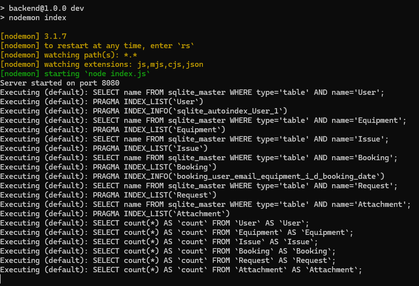

# How to Run

Note that this is not a comprehensive guide and you will likely encounter issues that will require some light troubleshooting to fix. Be sure to read output from your terminals and browser console if you get stuck.

- Clone the repository

## Local Development Servers

- Open two terminals and navigate to the frontend folder in one and the backend folder in the other
- In frontend/src/App.tsx, set the value of 'response' to match the following: `const response = await axios.get("http://localhost:8080/users");`
- Run `npm list` in the frontend terminal and ensure that all of the following packages are installed:
  ```
  +-- @eslint/js@9.12.0
  +-- @types/node@22.7.6
  +-- @types/react-dom@18.3.1
  +-- @types/react@18.3.11
  +-- @vitejs/plugin-react@4.3.2
  +-- axios@1.7.7
  +-- eslint-plugin-react-hooks@5.1.0-rc-fb9a90fa48-20240614
  +-- eslint-plugin-react-refresh@0.4.12
  +-- eslint@9.12.0
  +-- globals@15.11.0
  +-- react-dom@18.3.1
  +-- react@18.3.1
  +-- typescript-eslint@8.9.0
  +-- typescript@5.6.3
  `-- vite@5.4.9
  ```
- Run `npm list` in the backend terminal and ensure that all of the following packages are installed:
  ```
  +-- cors@2.8.5
  +-- express@4.21.1
  +-- nodemon@3.1.7
  +-- sequelize@6.37.4
  `-- sqlite3@5.1.7
  ```
- In backend/seed.js, set the value of the variable 'clear' to true (WARNING: this will clear all data in backend/database.db)
- Run `npm run dev` in both terminals
  - The frontend terminal should look similar to this:
    
  - The backend terminal should look similar to this:
    
- Open a browser and go to http://localhost:5173/
  - If this link doesn't work, try selecting one of the links displayed in the frontend terminal
  - The page should like this:<br>
    

## Docker Containers

- Confirm that you can run the project on local development servers as detailed above before attempting to run it on Docker
- Open a terminal and navigate to the project root
- In frontend/src/App.tsx, set the value of 'response' to match the following: `const response = await axios.get("http://localhost:5001/users");`
- Build the images by running `docker-compose build`
- Run the containers by running `docker-compose up`
- Open a browser and go to http://localhost:8800/
  - The page should look the same as above

## Database Schema and Seeding

- Confirm that you can run the project on Docker
- All schema files and associated relationships are defined in `backend/models/`'. A visual diagram can be seen at `models/schema-diagram.png`.
- The seeding is done in `backend/seed.js`. By default, the entire DB is wiped and re-seeded on container startup. This default will be changed in the future.
- As soon as you run the containers, both the schema and seeding will occur automatically.
- If the schema is changed, the database needs to be deleted and reset. 
